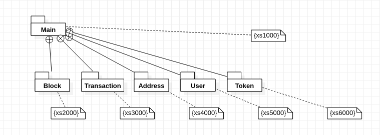

# XScan 사이트 개발 문서

Created: 2022년 2월 16일 오전 9:42
Last Edited Time: 2022년 2월 16일 오전 11:57

# RNSCAN

RN Scan

## 프로젝트 정의

[이더리움 스캔 사이트](https://etherscan.io/)

## 작업 환경

(S6)Test 서버 6번

- ip : [54.169.135.228:5040](http://54.169.135.228:5040/site/index.html)
- 경로
  - Front : /var/www/html/site
  - Back : ~/test/perl/TestPerl WebSocket.pl
- 도메인 : [http://54.169.135.228:5040/site/index.html](http://54.169.135.228:5040/site/index.html)

## 현 서비스 서버

(J1)메인 서버 \*번

- ip :
- 경로 :
- 서비스 경로 : [http://54.169.135.228:5040/site/index.html](http://54.169.135.228:5040/site/index.html)

## 기술 배경

이더리움 네트워크 기반의 메인 넷 구축
ERC 20 기반 Contract 구현
Perl을 활용한 WebSocket 통신을 활용한 API 서버 구축
JavaScript를 활용하여 API Server로 전송된 데이터 가공 및 화면 구성

### 블록 체인

- 블록체인 기술
- ERC 20
  - 표준안 메소드 정의
     ```
     event Transfer(address indexed _from, address indexed _to, uint256 _value)
    event Approval(address indexed _owner, address indexed _spender, uint256 _value)

    function name() public view returns (string)
    function symbol() public view returns (string)
    function decimals() public view returns (uint8)
    function totalSupply() public view returns (uint256)
    function balanceOf(address _owner) public view returns (uint256 balance)
    function transfer(address _to, uint256 _value) public returns (bool success)
    function transferFrom(address _from, address _to, uint256 _value) public returns (bool success)
    function approve(address _spender, uint256 _value) public returns (bool success)
    function allowance(address _owner, address _spender) public view returns (uint256 remaining)
     ```

### 이더리움 (Geth)

- **Geth version**
  ```bash
  Geth
  Version: 1.10.14-stable
  Git Commit: 11a3a35097ec493d71137c9bfa433bceeedff6c0
  Git Commit Date: 20211223
  Architecture: 386
  Go Version: go1.17.5
  Operating System: linux
  GOPATH=
  GOROOT=go
  ```
- **Init**
  - Genesis.json , static-nodes.json
    ```json
    //genesis.json
    {
      "config": {
        "chainId": 6794,
        "homesteadBlock": 0,
         "byzantiumBlock": 0,
      "constantinopleBlock": 0,
        "eip150Block": 0,
        "eip155Block": 0,
        "eip158Block": 0
      },
      "alloc": {},
      "coinbase": "0x3333333333333333333333333333333333333333",
      "difficulty": "0x4000",
      "extraData": "",
      "gasLimit": "0x80000000",
      "nonce": "0x0000000000000042",
      "mixhash": "0x0000000000000000000000000000000000000000000000000000000000000000",
      "parentHash": "0x0000000000000000000000000000000000000000000000000000000000000000",
      "timestamp": "0x00"
    }
    //static_nodes.json
    [
      "enode://e5daa4b9633d694a6a48245af6100a250b872690bf3c3b80c6d195bb37999ed4abc9415ca37328d8f930dd53ba3ed968d1f299bb5a7c43c877c424ef9c3c6ed1@18.139.114.143:5007",
      "enode://24d9d758078fe695149f4823517a5698d06939cbfddd656f45ed02d5c7064e71447ec1d89cf237b78019761fd462b52e912f7c1bb2b9f77bb033fe6de7879c38@54.251.56.154:5007",
      "enode://dbbad536610f3165ce6e7d2ca1384100586ac80b4c0d665d5b88271b03033860051864bd5d17ba88c613fdb6ca7b93dd6bcdc8103ac7267c7f3aa416955fde71@54.255.166.150:5007",
      "enode://c8cc89bf7700f38ddc16c87b42986845523dccce8eff53c0d6c4a4af1a44992e860f5938bce6f0e991933b94c458f0e76eee943e4d0d6f5bbf4349a94be0b994@54.254.187.191:5007",
      "enode://69e4122e040dd00d8be175378411558c13777e3ed9c95fe91fdf8d4d8544b266e9f680763ae572c592f9e2e71cd68aa89a7bf009751660bd6f5eada1eebeb384@18.141.189.104:5007"
    ]
    ```
- **Start**
  ```bash
  ./geth --networkid 6794 \
      --http --http.api "admin,debug,db,eth,net,web3,miner,personal" \
      --http.port "5006" \
      --port 5007 \
      --vmdebug \
      --nodiscover \
      --datadir ./data/ \
      --http.addr "127.0.0.1"      \
      --http.corsdomain "*" \
      --allow-insecure-unlock \
      --unlock 0xdaa6ac628dcbae26812d78ac369db387403f79b7 \
      --password ./data/password.txt      \
      --ws --ws.port 3334 -ws.api eth,net,web3 \
      --ws.origins "*"
  ```

### Web3

- **블록 , 트랜잭션 리스트**
  - `eth.blockNumber` `eth.getBlock`
  - `eth.getBlock` `eth.blockNumber` `eth.getTransaction` `transacions`
- **최근 블록 , 트랜잭션 조회**
  - `eth.getBlock(eth.blockNumber))`
  - `eth.getTransaction(transactionhash)` , `eth.getTransactionReceipt(transactionHash)`
- **세부 블록 및 트랜잭션 확인**
  - `eth.getBlock(blockNumber)`
  - `eth.getTransaction(transactionhash)`
- **계좌 관련**
  - `eth.accounts`
  - `personal.unlockAccount(eth.coinbase)`
  - `miner.start()` `miner.stop()`
- **개별 계좌 트랜잭션 조회**
  ```jsx
  while (counter < $count) {
    if (transactionList.length < 10) {
      var block = eth.getBlock(currentBlock);
      if (block && block.transactions) {
        block.transactions.forEach(value => {
          const recepit = eth.getTransactionReceipt(value);
          if (recepit.from === myAddr) {
            transactionList.push(recepit);
          }
        });
      }
      counter++;
      currentBlock--;
    }
  }
  ```

### Perl

- **use Expect**
  다른 응용 어프리케이션과 상호대화(interactive) 할 수 있게 만든 모듈
  ```perl
  $command = Expect->spawn("geth attach http://172.31.28.83:5006\r");
  $timeout = 10;
      unless( $command->expect($timeout, -re => '[#>\$] $' )){
          print ("expect delay too looose");
      }
  print $command "JSON.stringify(eth.getBlock(eth.blockNumber));\r";
  ```
- **use Switch**
  Switch case 사용하기 위한 모듈
- **사용자 정의 모듈**
  Web3.pm로 구성하여 실행될 스크립트에 import 진행
  ```perl
  # /home/ubuntu/perl5/lib/perl5
  use Web3;
  ```
  Web3.pm
  모듈에 필요한 부수적인 모듈 import 및 메소드 정의
  ```perl
  package Web3;
  use Expect;
  my $command;
  my $timeout;

  sub connnectionGeth {}
  sub getLatestBlock {}
  ......

  1;
  ```
- **문자열 처리**
  replace , split 활용
  ```perl
  @splitReq =split("/",$clientReq);
  $result=~s/\x1b\[[0-9;]*m//g;
  ```
- **curl**
  ```perl
  my $command = Expect->spawn("curl --data '$data'  -H \"Content-Type: application/json\" -X POST 54.169.135.228:5006");
  ```

### WebSocket

use Net::WebSocket::Server 모듈을 활용하여 개발

```perl
#!/usr/bin/perl
use Net::WebSocket::Server;
Net::WebSocket::Server->new(
    listen => 5009,
    on_connect => sub {
        my ($serv, $conn) = @_;
        $conn->on(
            utf8 => sub {
                my ($conn, $msg) = @_;
                &swithCase($conn, $msg);
            },
        );
    },
)->start;
```

### JavaScript(Web3JS)

경로 : **/js/src/...**

- **Web3.js**
  **version 1.7.0**
  - **Contract 관련 메소드 호출**
    ```jsx
    // 배포 컨트랙트 조회
    const contract = await new eth.Contract(ERC20_abi, contractAddress, {
      from: fromAccount,
    });
    // 배포 컨트랙트 메소드 호춣
    await contract.methods.name().call();
    await contract.methods
      .transfer("0xb343D82744514B03f81eB00fF18bb7C4ADc1a9DF", 6)
      .send({
        from: "0x3C9b507678E0C7C6390D696453e4739DA2a5BC44",
      })
      .then(async result => {
        userList.map(async v => await contract.methods.balanceOf(v).call());
        const data = await Promise.all(UserTokenList);
        console.log("=======AfterUserToken=======\n", data);
      });
    ```
  - **CURL 데이터 전송 Encoding & Decoding**
    ```jsx
    //통합적으로 인코딩하는 메소드 정의
    function encodingCurlOfRequestParam(
      web3,
      { method, fromHash, contractHash, data = "" },
      abi
    ) {
      const requestJSONRPCFormat = {
        jsonrpc: "2.0",
        id: Math.floor(Math.random() * 10),
        method: "",
        params: [
          {
            data: "",
            from: `${fromHash}`,
            to: `${contractHash}`,
          },
        ],
      };
    	........
      ........
      }
      return JSON.stringify(requestJSONRPCFormat);
    }
    //WebSocket 전송받은 데이터 디코딩
    function decodingCurlOfResponseResult(data, convertType) {
      return web3.eth.abi.decodeParameter(convertType, data);
    }
    ```
- **WebSocket**
  ```jsx
  //전역 접근을 위한 socket 변수
  let global_socket = null;

  class NetworkTryObj {
    constructor(address, port) {
      this.locationAddress = address;
      this.locationPort = port;
      this.WSsocket;
      this.deadSocket;
      this.setTimer;
      this.connection;
    }

  	//소켓 connection 2초단위 확인
    ObservingWSSocket = () => {....};

  	//웹소켓 초기화
    webSocketInit = callback => {....};

  	// 웹소켓 데이터 전송 @Param 1차 배열
    sendMsgToSocket = param => {....};

    // 웹소켓 CURL통신 메소드 @Param 1차 배열
    sendMsgToSocketParamJSON = param => {....};

  	// @Deprecated
    WSSocketValidConnect = () => {...};

  	//객체 멤버 변수 일괄 변경
    setWSocketObjMember = (connectionName,deadSocket,scope,setData,callback) => {....}
  ```

### 퍼블리싱

- 링크 방식
  - a href 활용하여 링크 구성
    queryString을 통해 정보 전송 `?account=0x183274ijolsadfjlsidhfgkasl`
- 쿠키,세션 정보 관리

## 개념도




